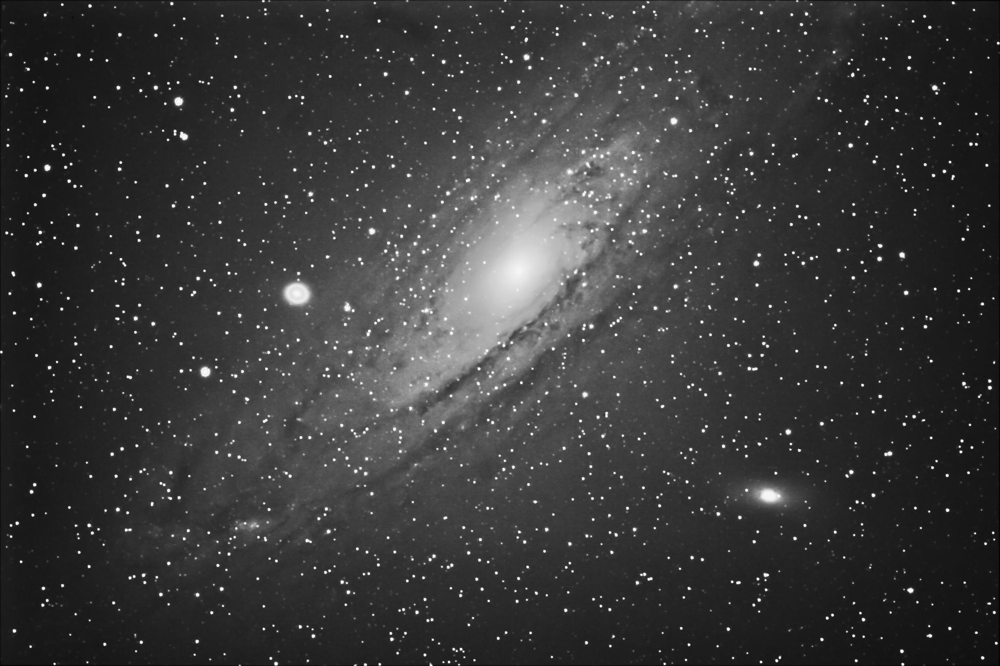
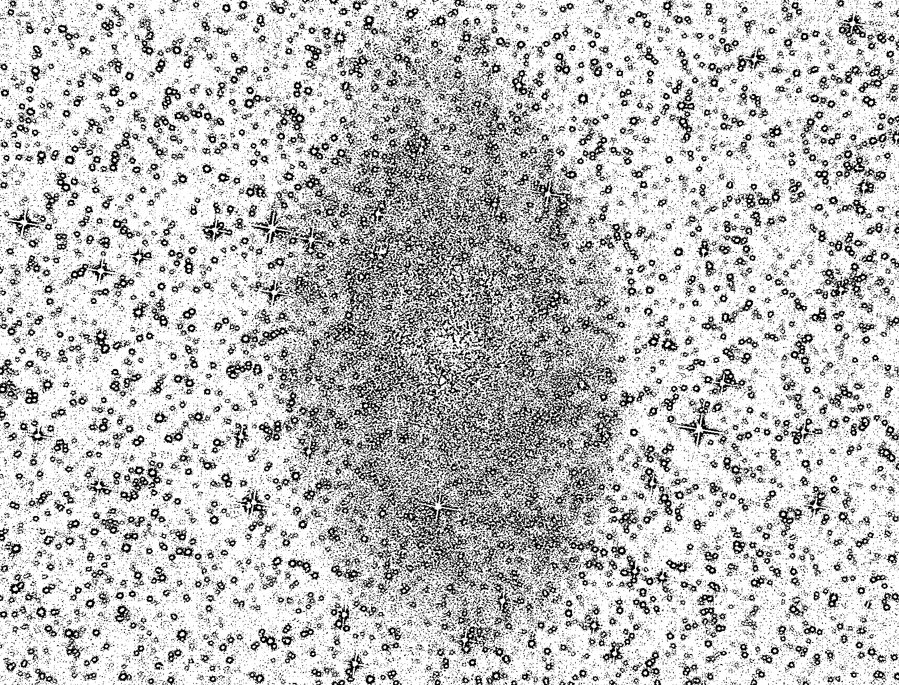

# Star Counter in Astronomy Images

## Overview
This project provides a Python script that counts the number of stars in astronomical images, specifically designed to ignore galaxies. Utilizing OpenCV, the script processes images to detect and count stars through a series of image processing techniques. The goal is to offer a tool for astronomers and enthusiasts to easily quantify stars in their captured images without the interference of galactic bodies.

## Prerequisites
- Python 3.6 or newer
- OpenCV library
- NumPy library

## Installation
Clone the repository to your local machine:
```bash
git clone <repository-url>
pip install numpy opencv-python
```
## Usage
To use the script, navigate to the cloned directory and run:

```bash
python star_counter.py <path_to_your_image>
```
Replace <path_to_your_image> with the path to the image file you wish to process.

## Algorithm Workflow

### Threshold Processing
Let's have a look at the following image of hte The Andromeda Galaxy, a spiral galaxy approximately 2.5 million light-years from Earth in the constellation Andromeda.</br>
<p align="center">
  
</p>
We are going to be using Adaptive thresholding. It is particularly useful in situations where the lighting across an image is uneven or when the background and foreground contrast varies throughout the scene. </br>
For images where galaxies are present alongside stars, the local contrast adjustment provided by adaptive thresholding can help differentiate galaxies from the background and nearby stars, especially in images where the brightness of galaxies gradually fades into the background.</br>
Astronomy images often suffer from gradients in brightness, such as those caused by the Milky Way or light pollution. Adaptive thresholding can adjust for these gradients, allowing for better detection of faint celestial objects.</br></br>
Here are the results after the adaptive thresholding:
<p align="center">
  
</p>
We can see how the astronomy objects were extracted with a black border surronding each one.

## Edge detection

## Watershed


